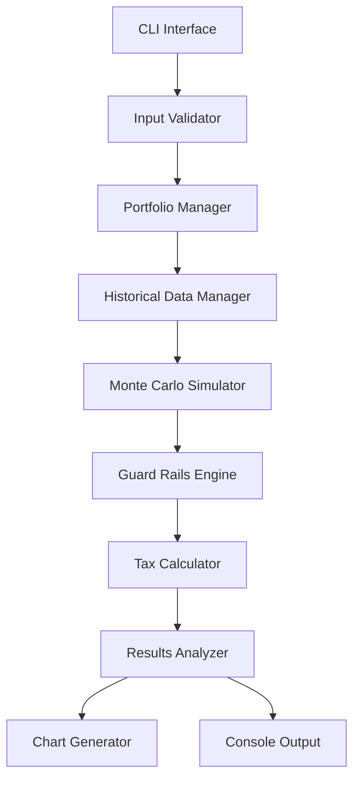

# Design Document

## Overview

The retirement calculator is a command-line Python application that uses Monte Carlo simulation with historical market data to predict retirement feasibility across multiple portfolio allocations. The tool implements a guard rails withdrawal system and accounts for UK taxation, presenting all results in real (inflation-adjusted) terms.

The application follows a modular architecture with clear separation between data management, simulation logic, tax calculations, and output generation. It prioritizes simplicity and maintainability while providing comprehensive retirement analysis.

## Architecture

### High-Level Architecture



### Core Components

1. **CLI Interface**: Handles user input collection and command-line interaction
2. **Historical Data Manager**: Loads and manages historical market and inflation data
3. **Portfolio Manager**: Manages the 6 different portfolio allocations
4. **Monte Carlo Simulator**: Runs thousands of retirement scenarios
5. **Guard Rails Engine**: Implements spending adjustments based on portfolio performance
6. **Tax Calculator**: Applies UK tax calculations to withdrawal amounts
7. **Results Analyzer**: Processes simulation results and calculates success rates
8. **Chart Generator**: Creates time series visualizations

## Components and Interfaces

### Data Models

#### UserInput
```python
@dataclass
class UserInput:
    current_age: int
    current_savings: float  # In today's pounds
    monthly_savings: float  # In today's pounds
    desired_annual_income: float  # In today's pounds, after-tax
```

#### PortfolioAllocation
```python
@dataclass
class PortfolioAllocation:
    name: str
    equity_percentage: float
    bond_percentage: float
    cash_percentage: float
```

#### SimulationResult
```python
@dataclass
class SimulationResult:
    portfolio_allocation: PortfolioAllocation
    retirement_age: int
    success_rate: float
    portfolio_values_over_time: List[List[float]]  # [scenario][year]
    percentile_10: List[float]
    percentile_50: List[float]
    percentile_90: List[float]
```

### Historical Data Manager

Responsible for loading and processing historical market data:

- **Equity Returns**: Historical UK/Global equity returns (real terms)
- **Bond Returns**: Historical UK government/corporate bond returns (real terms)
- **Inflation Data**: Historical UK inflation rates for real return calculations
- **Data Sources**: CSV files with annual return data, easily updatable

```python
class HistoricalDataManager:
    def load_equity_returns(self) -> List[float]
    def load_bond_returns(self) -> List[float]
    def load_inflation_rates(self) -> List[float]
    def get_real_returns(self, nominal_returns: List[float], inflation_rates: List[float]) -> List[float]
```

### Monte Carlo Simulator

Core simulation engine that runs thousands of scenarios:

- **Simulation Count**: 10,000+ scenarios per portfolio allocation
- **Methodology**: Bootstrap sampling from historical return sequences
- **Time Horizon**: From current age to age 100
- **Integration**: Works with guard rails and tax calculations

```python
class MonteCarloSimulator:
    def run_simulation(self, user_input: UserInput, portfolio: PortfolioAllocation, num_simulations: int = 10000) -> SimulationResult
    def simulate_single_scenario(self, user_input: UserInput, portfolio: PortfolioAllocation, return_sequence: List[float]) -> bool
```

### Guard Rails Engine

Implements dynamic spending adjustments based on portfolio performance:

- **Upper Guard Rail**: 20% above initial portfolio value → allow normal spending
- **Lower Guard Rail**: 15% below initial portfolio value → reduce spending by 10%
- **Severe Guard Rail**: 25% below initial portfolio value → reduce spending by 20%
- **Recovery**: Gradual return to normal spending as portfolio recovers

```python
class GuardRailsEngine:
    def calculate_withdrawal_adjustment(self, current_portfolio_value: float, initial_portfolio_value: float, years_in_retirement: int) -> float
    def get_adjusted_withdrawal(self, base_withdrawal: float, adjustment_factor: float) -> float
```

### Tax Calculator

Handles UK tax calculations for retirement withdrawals:

- **Personal Allowance**: Current UK personal allowance threshold
- **Tax Bands**: Basic rate (20%), higher rate (40%), additional rate (45%)
- **Gross Calculation**: Determines gross withdrawal needed for desired net income
- **Future-Proof**: Tax rates easily updatable in configuration

```python
class UKTaxCalculator:
    def calculate_gross_withdrawal_needed(self, desired_net_income: float) -> float
    def calculate_tax_on_income(self, gross_income: float) -> float
    def get_net_income(self, gross_income: float) -> float
```

## Data Models

### Historical Data Structure

Data stored in CSV files for easy updates:

```
data/
├── uk_equity_returns.csv      # Annual real returns
├── uk_bond_returns.csv        # Annual real returns
├── uk_inflation_rates.csv     # Annual inflation rates
└── portfolio_allocations.csv  # Predefined allocations
```

### Portfolio Allocations

Six predefined portfolios:
1. **100% Cash**: 0% equity, 0% bonds, 100% cash (0% real return)
2. **100% Bonds**: 0% equity, 100% bonds, 0% cash
3. **25/75 Portfolio**: 25% equity, 75% bonds, 0% cash
4. **50/50 Portfolio**: 50% equity, 50% bonds, 0% cash
5. **75/25 Portfolio**: 75% equity, 25% bonds, 0% cash
6. **100% Equity**: 100% equity, 0% bonds, 0% cash

### Simulation Data Flow

1. **Input Collection**: Gather user financial data
2. **Data Loading**: Load historical returns and inflation data
3. **Portfolio Setup**: Configure 6 portfolio allocations
4. **Simulation Loop**: For each portfolio, run 10,000+ scenarios
5. **Guard Rails Application**: Apply spending adjustments in each scenario
6. **Tax Calculation**: Apply UK tax to each withdrawal
7. **Success Evaluation**: Check if money lasts to age 100
8. **Results Aggregation**: Calculate success rates and percentiles

## Error Handling

### Input Validation
- **Age Validation**: Must be between 18-80
- **Savings Validation**: Must be non-negative
- **Income Validation**: Must be positive and reasonable

### Data Loading Errors
- **Missing Files**: Clear error messages with file paths
- **Invalid Data**: Validation of historical data format
- **Graceful Degradation**: Continue with available data where possible

### Simulation Errors
- **Memory Management**: Handle large simulation datasets efficiently
- **Calculation Errors**: Validate intermediate results
- **Progress Indication**: Show simulation progress for long-running calculations

## Testing Strategy

### Unit Testing
- **Tax Calculator**: Test various income levels and tax scenarios
- **Guard Rails Engine**: Test adjustment calculations
- **Data Loading**: Test with sample historical data
- **Input Validation**: Test edge cases and invalid inputs

### Integration Testing
- **End-to-End Simulation**: Test complete workflow with known data
- **Portfolio Comparison**: Verify relative performance makes sense
- **Chart Generation**: Ensure visualizations render correctly

### Data Validation Testing
- **Historical Data**: Validate data ranges and formats
- **Real Returns**: Verify inflation adjustments are correct
- **Tax Calculations**: Cross-check with HMRC tax calculators

### Performance Testing
- **Simulation Speed**: Ensure 10,000 simulations complete in reasonable time
- **Memory Usage**: Monitor memory consumption during large simulations
- **Chart Generation**: Test visualization performance with large datasets

## Implementation Notes

### Technology Stack
- **Python 3.8+**: Core language
- **NumPy**: Numerical calculations and array operations
- **Pandas**: Data manipulation and CSV handling
- **Matplotlib**: Chart generation for time series plots
- **Click**: Command-line interface framework

### Key Design Decisions

1. **CSV Data Storage**: Chosen for simplicity and easy updates over database
2. **Bootstrap Sampling**: Use historical return sequences rather than parametric distributions
3. **Real Returns Focus**: All calculations in inflation-adjusted terms for clarity
4. **Modular Architecture**: Separate concerns for maintainability
5. **Command-Line Only**: No GUI to maintain simplicity as requested

### Performance Considerations
- **Vectorized Operations**: Use NumPy for efficient array calculations
- **Memory Efficiency**: Process simulations in batches if needed
- **Caching**: Cache loaded historical data between portfolio runs
- **Progress Feedback**: Show progress for long-running simulations