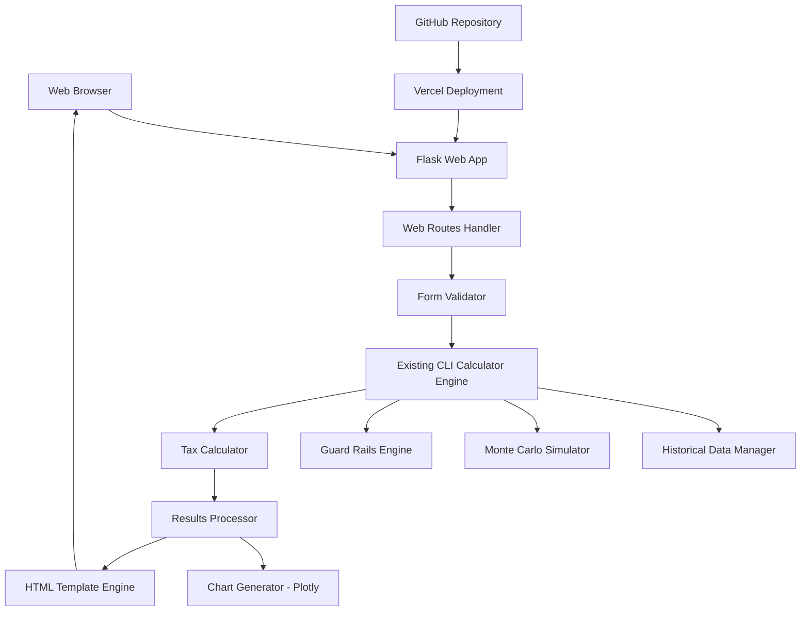

# Design Document

## Overview

The web frontend is a Flask-based web application that provides a simple, clean interface for the retirement calculator. It reuses the existing calculation engine from the CLI tool while adding a responsive web interface with interactive charts. The application is designed for easy deployment to Vercel with automatic GitHub integration.

The design prioritizes simplicity, reliability, and mobile-first responsive design while maintaining the same calculation accuracy as the CLI tool.

## Architecture

### High-Level Architecture



### Technology Stack

- **Backend**: Flask (lightweight Python web framework)
- **Frontend**: HTML5, CSS3, JavaScript (vanilla, no complex frameworks)
- **Charts**: Plotly.js for interactive charts
- **Styling**: CSS Grid/Flexbox with mobile-first responsive design
- **Deployment**: Vercel with automatic GitHub integration
- **Calculation Engine**: Reuse existing CLI modules (src/*)

## Components and Interfaces

### Web Application Structure

```
web/
├── app.py                    # Flask application entry point
├── routes.py                 # Web route handlers
├── forms.py                  # Form validation and processing
├── chart_generator.py        # Web-specific chart generation
├── templates/
│   ├── base.html            # Base template with common layout
│   ├── index.html           # Main calculator form
│   └── results.html         # Results display page
├── static/
│   ├── css/
│   │   └── style.css        # Main stylesheet
│   └── js/
│       └── app.js           # Client-side JavaScript
├── requirements-web.txt      # Additional web dependencies
└── vercel.json              # Vercel deployment configuration
```

### Flask Application (app.py)

```python
from flask import Flask
from routes import calculator_routes
import os

def create_app():
    """Application factory pattern for better testing and deployment"""
    app = Flask(__name__)
    
    # Configuration
    app.config.from_mapping(
        SECRET_KEY=os.environ.get('SECRET_KEY', 'dev-key-change-in-production'),
        TESTING=False,
    )
    
    # Register blueprints
    app.register_blueprint(calculator_routes)
    
    return app

# For Vercel deployment
app = create_app()

if __name__ == '__main__':
    app.run(debug=True, port=8000)
```

### Route Handlers (routes.py)

```python
from flask import Blueprint, render_template, request, jsonify
from forms import CalculatorForm
from src.models import UserInput
from src.simulator import MonteCarloSimulator
from chart_generator import generate_web_charts

calculator_routes = Blueprint('calculator', __name__)

@calculator_routes.route('/')
def index():
    return render_template('index.html')

@calculator_routes.route('/calculate', methods=['POST'])
def calculate():
    form = CalculatorForm(request.form)
    if form.validate():
        user_input = form.to_user_input()
        results = run_simulation(user_input)
        charts = generate_web_charts(results)
        return jsonify({
            'success': True,
            'results': results,
            'charts': charts
        })
    return jsonify({
        'success': False,
        'errors': form.errors
    })
```

### Form Validation (forms.py)

```python
from wtforms import Form, IntegerField, FloatField, validators

class CalculatorForm(Form):
    current_age = IntegerField('Current Age', [
        validators.NumberRange(min=18, max=80, message="Age must be between 18 and 80")
    ])
    current_savings = FloatField('Current Savings (£)', [
        validators.NumberRange(min=0, message="Savings cannot be negative")
    ])
    monthly_savings = FloatField('Monthly Savings (£)', [
        validators.NumberRange(min=0, message="Monthly savings cannot be negative")
    ])
    desired_annual_income = FloatField('Desired Annual Income (£)', [
        validators.NumberRange(min=1000, message="Annual income must be at least £1,000")
    ])
    
    def to_user_input(self):
        return UserInput(
            current_age=self.current_age.data,
            current_savings=self.current_savings.data,
            monthly_savings=self.monthly_savings.data,
            desired_annual_income=self.desired_annual_income.data
        )
```

### Web Chart Generator (chart_generator.py)

```python
import plotly.graph_objects as go
import plotly.utils
import json

def generate_web_charts(simulation_results):
    """Generate Plotly charts for web display using best practices"""
    charts = {}
    
    for result in simulation_results:
        fig = go.Figure()
        
        # Add percentile lines with proper fill area
        years = list(range(len(result.percentile_10)))
        
        # Add 90th percentile (upper bound)
        fig.add_trace(go.Scatter(
            x=years, 
            y=result.percentile_90,
            fill=None, 
            mode='lines',
            line=dict(color='rgba(0,100,80,0.3)', width=1),
            name='90th Percentile',
            showlegend=False
        ))
        
        # Add 10th percentile with fill to previous trace
        fig.add_trace(go.Scatter(
            x=years, 
            y=result.percentile_10,
            fill='tonexty',  # Fill to previous trace
            mode='lines',
            line=dict(color='rgba(0,100,80,0.3)', width=1),
            fillcolor='rgba(0,100,80,0.1)',
            name='10th-90th Percentile Range'
        ))
        
        # Add median line (most prominent)
        fig.add_trace(go.Scatter(
            x=years, 
            y=result.percentile_50,
            mode='lines',
            line=dict(color='rgb(0,100,80)', width=3),
            name='Median (50th Percentile)'
        ))
        
        # Optimize layout for web display
        fig.update_layout(
            title=dict(
                text=f'{result.portfolio_allocation.name} Portfolio Projection',
                x=0.5,
                font=dict(size=16)
            ),
            xaxis=dict(
                title='Years from Now',
                showgrid=True,
                gridcolor='rgba(128,128,128,0.2)'
            ),
            yaxis=dict(
                title='Portfolio Value (£, today\'s money)',
                showgrid=True,
                gridcolor='rgba(128,128,128,0.2)',
                tickformat=',.0f'
            ),
            hovermode='x unified',
            showlegend=True,
            legend=dict(
                orientation="h",
                yanchor="bottom",
                y=1.02,
                xanchor="right",
                x=1
            ),
            margin=dict(l=60, r=30, t=60, b=60),
            height=400,
            plot_bgcolor='white',
            paper_bgcolor='white'
        )
        
        # Remove template to reduce JSON size
        fig.layout.template = None
        
        # Convert to JSON for web display
        charts[result.portfolio_allocation.name] = fig.to_json()
    
    return charts

def generate_comparison_chart(simulation_results):
    """Generate a single chart comparing all portfolios"""
    fig = go.Figure()
    
    colors = ['#1f77b4', '#ff7f0e', '#2ca02c', '#d62728', '#9467bd', '#8c564b']
    
    for i, result in enumerate(simulation_results):
        years = list(range(len(result.percentile_50)))
        color = colors[i % len(colors)]
        
        fig.add_trace(go.Scatter(
            x=years,
            y=result.percentile_50,
            mode='lines',
            line=dict(color=color, width=2),
            name=result.portfolio_allocation.name
        ))
    
    fig.update_layout(
        title='Portfolio Comparison - Median Projections',
        xaxis_title='Years from Now',
        yaxis_title='Portfolio Value (£, today\'s money)',
        hovermode='x unified',
        height=500,
        showlegend=True
    )
    
    fig.layout.template = None
    return fig.to_json()
```

## Data Models

### Web-Specific Models

The web application reuses the existing data models from the CLI tool:
- `UserInput` from `src/models.py`
- `PortfolioAllocation` from `src/models.py`
- `SimulationResult` from `src/models.py`

### Additional Web Models

```python
@dataclass
class WebCalculationResult:
    """Web-specific result format"""
    portfolio_results: List[SimulationResult]
    recommended_portfolio: str
    calculation_time: float
    charts_data: Dict[str, str]  # JSON strings for Plotly
```

## User Interface Design

### Layout Structure

```html
<!DOCTYPE html>
<html lang="en">
<head>
    <meta charset="UTF-8">
    <meta name="viewport" content="width=device-width, initial-scale=1.0">
    <title>Retirement Calculator</title>
    <link rel="stylesheet" href="{{ url_for('static', filename='css/style.css') }}">
</head>
<body>
    <div class="container">
        <header>
            <h1>UK Retirement Calculator</h1>
            <p>Plan your retirement with confidence using historical market data</p>
        </header>
        
        <main>
            <section class="input-section">
                <!-- Calculator Form -->
            </section>
            
            <section class="results-section" id="results" style="display: none;">
                <!-- Results Table and Charts -->
            </section>
        </main>
    </div>
</body>
</html>
```

### Form Design

```html
<form id="calculator-form" class="calculator-form">
    <div class="form-group">
        <label for="current_age">Current Age</label>
        <input type="number" id="current_age" name="current_age" min="18" max="80" required>
        <small class="help-text">Your age today (18-80)</small>
    </div>
    
    <div class="form-group">
        <label for="current_savings">Current Savings (£)</label>
        <input type="number" id="current_savings" name="current_savings" min="0" step="1000" required>
        <small class="help-text">Total retirement savings you have now</small>
    </div>
    
    <div class="form-group">
        <label for="monthly_savings">Monthly Savings (£)</label>
        <input type="number" id="monthly_savings" name="monthly_savings" min="0" step="100" required>
        <small class="help-text">How much you save each month for retirement</small>
    </div>
    
    <div class="form-group">
        <label for="desired_annual_income">Desired Annual Income (£)</label>
        <input type="number" id="desired_annual_income" name="desired_annual_income" min="1000" step="1000" required>
        <small class="help-text">After-tax income you want in retirement (today's money)</small>
    </div>
    
    <button type="submit" class="calculate-btn">Calculate My Retirement</button>
</form>
```

### Results Display

```html
<div class="results-container">
    <h2>Your Retirement Options</h2>
    
    <div class="recommended-portfolio">
        <h3>Recommended: <span id="recommended-name"></span></h3>
        <p>Retire at age <strong id="recommended-age"></strong> with <strong id="recommended-success"></strong> confidence</p>
    </div>
    
    <table class="results-table">
        <thead>
            <tr>
                <th>Portfolio</th>
                <th>Retirement Age</th>
                <th>Success Rate</th>
                <th>Portfolio Value</th>
            </tr>
        </thead>
        <tbody id="results-tbody">
            <!-- Results populated by JavaScript -->
        </tbody>
    </table>
    
    <div class="charts-container">
        <div class="chart-selector">
            <label for="portfolio-select">View Portfolio:</label>
            <select id="portfolio-select">
                <!-- Options populated by JavaScript -->
            </select>
        </div>
        <div id="chart-display"></div>
    </div>
</div>
```

## Responsive Design

### CSS Grid Layout

```css
.container {
    max-width: 1200px;
    margin: 0 auto;
    padding: 20px;
    display: grid;
    grid-template-rows: auto 1fr;
    gap: 2rem;
}

.calculator-form {
    display: grid;
    grid-template-columns: repeat(auto-fit, minmax(300px, 1fr));
    gap: 1.5rem;
    max-width: 800px;
}

.results-table {
    width: 100%;
    overflow-x: auto;
    display: block;
    white-space: nowrap;
}

@media (max-width: 768px) {
    .calculator-form {
        grid-template-columns: 1fr;
    }
    
    .results-table {
        font-size: 0.9rem;
    }
}
```

## Integration with Existing Code

### Reusing CLI Components

The web application imports and uses existing modules:

```python
# Import existing calculation engine
from src.models import UserInput, PortfolioAllocation
from src.data_manager import HistoricalDataManager
from src.portfolio_manager import PortfolioManager
from src.simulator import MonteCarloSimulator
from src.analyzer import ResultsAnalyzer
from src.tax_calculator import UKTaxCalculator
from src.guard_rails import GuardRailsEngine

def run_simulation(user_input: UserInput):
    """Reuse existing simulation logic"""
    data_manager = HistoricalDataManager()
    portfolio_manager = PortfolioManager()
    simulator = MonteCarloSimulator(data_manager)
    
    results = []
    for portfolio in portfolio_manager.get_all_portfolios():
        result = simulator.run_simulation(user_input, portfolio)
        results.append(result)
    
    return results
```

## Deployment Configuration

### Vercel Configuration (vercel.json)

```json
{
  "$schema": "https://openapi.vercel.sh/vercel.json",
  "version": 2,
  "builds": [
    {
      "src": "app.py",
      "use": "@vercel/python"
    }
  ],
  "routes": [
    {
      "src": "/(.*)",
      "dest": "app.py"
    }
  ],
  "functions": {
    "app.py": {
      "memory": 1024,
      "maxDuration": 30
    }
  },
  "regions": ["iad1"],
  "env": {
    "FLASK_ENV": "production"
  }
}
```

### Alternative Serverless Function Structure

For better Vercel integration, we can also structure as individual API routes:

```
api/
├── index.py              # Main calculator endpoint
├── calculate.py          # Calculation endpoint
└── requirements.txt      # Python dependencies
```

#### API Route Example (api/index.py)

```python
from http.server import BaseHTTPRequestHandler
from urllib.parse import parse_qs
import json
import sys
import os

# Add project root to path for imports
sys.path.append(os.path.join(os.path.dirname(__file__), '..'))

from src.models import UserInput
from src.simulator import MonteCarloSimulator

class handler(BaseHTTPRequestHandler):
    def do_GET(self):
        self.send_response(200)
        self.send_header('Content-type', 'text/html')
        self.end_headers()
        
        # Serve the main HTML page
        html_content = self.get_html_template()
        self.wfile.write(html_content.encode('utf-8'))
    
    def do_POST(self):
        content_length = int(self.headers['Content-Length'])
        post_data = self.rfile.read(content_length)
        
        try:
            # Parse form data and run calculation
            data = json.loads(post_data.decode('utf-8'))
            user_input = UserInput(**data)
            
            # Run simulation (simplified)
            results = self.run_calculation(user_input)
            
            self.send_response(200)
            self.send_header('Content-type', 'application/json')
            self.end_headers()
            
            response = {
                'success': True,
                'results': results
            }
            self.wfile.write(json.dumps(response).encode('utf-8'))
            
        except Exception as e:
            self.send_response(500)
            self.send_header('Content-type', 'application/json')
            self.end_headers()
            
            error_response = {
                'success': False,
                'error': str(e)
            }
            self.wfile.write(json.dumps(error_response).encode('utf-8'))
    
    def get_html_template(self):
        # Return the main HTML template
        return """
        <!DOCTYPE html>
        <html>
        <head>
            <title>Retirement Calculator</title>
            <meta charset="utf-8">
            <meta name="viewport" content="width=device-width, initial-scale=1.0">
        </head>
        <body>
            <div id="app">
                <!-- React/Vue app or vanilla JS form -->
            </div>
        </body>
        </html>
        """
    
    def run_calculation(self, user_input):
        # Simplified calculation logic
        return {"message": "Calculation completed"}
```

### Requirements (requirements-web.txt)

```
Flask==2.3.3
WTForms==3.0.1
plotly==5.17.0
gunicorn==21.2.0
```

### GitHub Actions (Optional Enhancement)

```yaml
name: Deploy to Vercel
on:
  push:
    branches: [main]
jobs:
  deploy:
    runs-on: ubuntu-latest
    steps:
      - uses: actions/checkout@v2
      - name: Deploy to Vercel
        uses: amondnet/vercel-action@v20
        with:
          vercel-token: ${{ secrets.VERCEL_TOKEN }}
          vercel-org-id: ${{ secrets.ORG_ID }}
          vercel-project-id: ${{ secrets.PROJECT_ID }}
```

## Error Handling

### Client-Side Validation

```javascript
function validateForm() {
    const form = document.getElementById('calculator-form');
    const inputs = form.querySelectorAll('input[required]');
    let isValid = true;
    
    inputs.forEach(input => {
        if (!input.value || input.value < input.min || input.value > input.max) {
            showError(input, 'Please enter a valid value');
            isValid = false;
        } else {
            clearError(input);
        }
    });
    
    return isValid;
}
```

### Server-Side Error Handling

```python
@calculator_routes.errorhandler(Exception)
def handle_calculation_error(error):
    return jsonify({
        'success': False,
        'error': 'Calculation failed. Please check your inputs and try again.',
        'details': str(error) if app.debug else None
    }), 500
```

## Performance Considerations

### Calculation Optimization

- **Async Processing**: Use background tasks for long calculations
- **Progress Updates**: WebSocket or polling for real-time progress
- **Caching**: Cache historical data loading
- **Resource Limits**: Respect Vercel's execution time limits

### Frontend Optimization

- **Lazy Loading**: Load charts only when needed
- **Minification**: Minify CSS and JavaScript
- **Compression**: Enable gzip compression
- **CDN**: Use CDN for Plotly.js library

## Testing Strategy

### Unit Testing

```python
def test_form_validation():
    form_data = {
        'current_age': 30,
        'current_savings': 50000,
        'monthly_savings': 1000,
        'desired_annual_income': 30000
    }
    form = CalculatorForm(data=form_data)
    assert form.validate()

def test_calculation_endpoint():
    with app.test_client() as client:
        response = client.post('/calculate', data=form_data)
        assert response.status_code == 200
        data = response.get_json()
        assert data['success'] == True
```

### Integration Testing

- **End-to-End**: Test complete user workflow
- **Cross-Browser**: Test on different browsers and devices
- **Mobile Testing**: Verify mobile responsiveness
- **Performance Testing**: Test calculation speed and memory usage